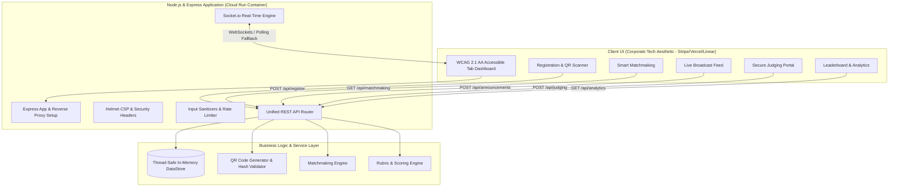

# SmartKinalEventPlatform 🚀
> **Unified Real-Time Smart Event & Hackathon Management Platform**  
> *Production-Ready, Highly Secure, Fully Accessible (WCAG 2.1 AA), and Optimized for Google Cloud Run.*

---

## 📌 Challenge & Vertical Alignment

**Chosen Vertical**: **Smart Event Operations & Hackathon Management Platform**

**Problem Statement**:
Event organizers, attendees, and hackathon judges traditionally fragment event operations across disconnected tools (spreadsheet check-ins, Discord broadcasts, manual matchmaking, and offline scoring sheets). This leads to slow check-in bottlenecks, low team formation rates, delayed broadcasts, and error-prone evaluation scoring.

**The Solution**:
`SmartKinalEventPlatform` provides a single unified real-time operations hub that orchestrates the complete lifecycle:
1. **Attendee Registration & Encrypted QR Check-in Badge Generator** + Scanner Simulator.
2. **Algorithmic Smart Team Matchmaking Engine** based on skill complementarity and role synergy.
3. **Live Announcement & Broadcast Center** powered by WebSockets (Socket.io) with accessibility live regions.
4. **Secure Judging Portal** featuring structured 5-criteria rubric evaluation.
5. **Live Leaderboard & Organizer Analytics Dashboard** with dynamic score aggregation and tie-breaker sorting.

---

## 🌟 System Architecture



---

## 🧮 Core Technical Logic & Mathematical Formulas

### 1. Smart Team Matchmaking Algorithm
Compatibility scores ($S$) between seekers and candidates are calculated across three weighted vectors:

$$S = \min\left(99, \max\left(15, \text{round}\Big(0.40 \cdot S_{\text{skills}} + 0.30 \cdot S_{\text{role}} + 0.30 \cdot S_{\text{interests}}\Big)\right)\right)$$

Where:
- **Skill Score** ($S_{\text{skills}}$):
  $$S_{\text{skills}} = 50 \cdot \min\left(1.0, \frac{|K_{\text{matched}}|}{\max(1, |K_{\text{seeker}}|)}\right) + 50 \cdot \min\left(1.0, \frac{|K_{\text{unique candidate}}|}{3}\right)$$
- **Role Synergy Score** ($S_{\text{role}}$): Assigned $100\%$ for complementary roles (e.g., Team Lead + Backend Architect), $80\%$ for non-identical roles, and $40\%$ for duplicate roles.
- **Interest Alignment Score** ($S_{\text{interests}}$): Percentage overlap of project domain tags.

### 2. Weighted Rubric Scoring Formula
Evaluations scale out of 100 points across five core hackathon criteria:

$$\text{Total Score} = 10 \cdot \Big(0.25 \cdot I + 0.25 \cdot T + 0.20 \cdot U + 0.15 \cdot M + 0.15 \cdot P\Big)$$

- **$I$**: Innovation & Originality (25%)
- **$T$**: Technical Complexity & Architecture (25%)
- **$U$**: UI/UX & Accessibility (20%)
- **$M$**: Potential Impact & Feasibility (15%)
- **$P$**: Pitch Presentation & Demo (15%)

---

## 🎨 Design System & UI/UX Guidelines

The interface follows a **sleek, corporate tech aesthetic** (inspired by Stripe, Vercel, and Linear):
- **Header Navigation**: Dark Slate (`#0f172a` / `bg-slate-900`).
- **Corporate Accents**: Classic Tech Blue (`#2563eb` / `blue-600`) for active tabs, links, primary buttons, and focus outlines.
- **Body Background**: Soft light grey (`#f8fafc` / `bg-slate-50`).
- **Surfaces & Cards**: Crisp white (`#ffffff` / `bg-white`) with subtle borders (`#e2e8f0` / `border-slate-200`) and minimal shadows (`shadow-sm`).
- **Typography**: Dark Slate (`#0f172a` / `#334155`) for contrast and readability.
- **Accessibility**: Full WCAG 2.1 AA compliance (ARIA live regions, semantic HTML5, keyboard arrow tab navigation).

---

## 💡 Assumptions & Technical Tradeoffs

1. **Zero External Database Dependency for Instant Deployment**:
   - The platform includes a thread-safe, in-memory state store (`dataStore.js`) pre-populated with realistic hackathon demo data (participants, teams, broadcasts, projects, and judging scores).
   - This ensures the application runs out-of-the-box on Google Cloud Run without requiring database connection strings or migrations.
2. **Stateless WebSockets for Serverless Cloud Run**:
   - Real-time events utilize Socket.io with HTTP polling fallback to ensure seamless client connectivity across autoscaled Cloud Run instances.

---

## ☁️ Google Cloud Run Optimization

- **Dynamic Port Binding**: Listens on `process.env.PORT || 8080`.
- **Multi-Stage Docker Build**: Minimal Node 20 Alpine production image.
- **Container Security**: Executes as non-root `USER node`.
- **Proxy Trust**: Configured `app.set('trust proxy', 1)` for Google Cloud SSL Load Balancer IP forwarding.

### Deployment 

https://smartkinalevent-platform.onrender.com/

---

## 🛠️ Local Installation & Running

```bash
# 1. Install dependencies
npm install

# 2. Run automated test suites (14 tests across 4 suites)
npm test

# 3. Start local production server
npm start
```

Access the dashboard at `http://localhost:8080`.

---

## 📄 License

Distributed under the MIT License. See `LICENSE` for details.
